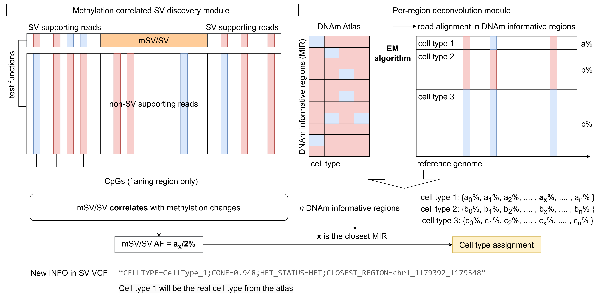

# sniffcell


### Sniffing DNA methylation changes around (Mosaic) structural variations. 

Although no need to do BAM file filtering, but sniffcell can only process primary alignments for now. A different threshold is suggested with fisher's exact test.

Usage:

```
usage: sniffcell [-h] [-t THREADS] -b BAM -v VCF -r REFERENCE -o OUTPUT [-d] [-a ATLAS] [-c TISSUE] [-n REGION_NUMBER] [-me METHOD] [-vb] [-conf CONFIDENCE] [-ob] [-p] [-s SMOOTHING] [-i INTERVAL] [-m MIN_SUPPORTING] [-th THRESHOLD] [-tf TEST_FUNCTION] [-b2 SECOND_BAM]

Annotating mosaic structural variants (SVs) with cell type-specific methylation information.

options:
  -h, --help            show this help message and exit
  -t THREADS, --threads THREADS
                        Number of threads, default 1.

Required arguments:
  -b BAM, --bam BAM     Input BAM file.
  -v VCF, --vcf VCF     Input SV VCF file (supporting reads needed).
  -r REFERENCE, --reference REFERENCE
                        Reference genome.
  -o OUTPUT, --output OUTPUT
                        Output directory. Default: /stornext/snfs130/fritz/Yilei/SniffMeth
  -d, --deconv          Run deconvolution if specified.

SniffMeth deconvolution optional arguments:
  -a ATLAS, --atlas ATLAS
                        Cell type atlas location. Default: /stornext/snfs130/fritz/Yilei/SniffMeth/src/atlas/39Bisulfite.tsv
  -c TISSUE, --tissue TISSUE
                        Tissue type in /stornext/snfs130/fritz/Yilei/SniffMeth/src/atlas/tissue_celltypes.json, need to update based on atlas. Default: brain_cereb.
  -n REGION_NUMBER, --region_number REGION_NUMBER
                        Number of regions to be selected, default 300.
  -me METHOD, --method METHOD
                        Region selection method: std or diff, default diff. Diff selects the regions with certain cell type as low methylation while all other cell types have high methylation. std selects regions with highest methylation value std in all cell types.
  -vb, --verbose        Enable verbose mode.
  -conf CONFIDENCE, --confidence CONFIDENCE
                        Minimum confidence threshold for EM algorithm. Default 0.9.

SniffMeth optional arguments:
  -ob, --output_bam     Output SV-related BAM file.
  -p, --primary_only    Keep only primary alignments in BAM.
  -s SMOOTHING, --smoothing SMOOTHING
                        Enable smoothing (0 = no smoothing). default 0.
  -i INTERVAL, --interval INTERVAL
                        Interval for checking methylation changes. default +-1000.
  -m MIN_SUPPORTING, --min_supporting MIN_SUPPORTING
                        Minimum supporting reads for SV. default 3.
  -th THRESHOLD, --threshold THRESHOLD
                        Threshold for differentially methylated regions. default 0.2.
  -tf TEST_FUNCTION, --test_function TEST_FUNCTION
                        Statistical test function. default ttest.
  -b2 SECOND_BAM, --second_bam SECOND_BAM
                        Benchmark BAM file. If provided, benchmarking will be performed.

Version 0.2.1
```
__Note 1: Test function recommendations:__
- t-test: Most general
- Mann-Whitney U: Most conservative
- Ranksum test, chi2, and Fisher's exact: Very variable when the two comparison lists do not have the same size (SV supporting reads vs. other reads)


Output:
- SV BAM file: Each BAM file contains a SV candidate with supporting reads and other reads in different read groups. This can help the user to visulize DNA methylation differences in IGV.
- CSV file: A CSV file that shows how different the DNA methylation in SV-supporting reads VS other reads. 