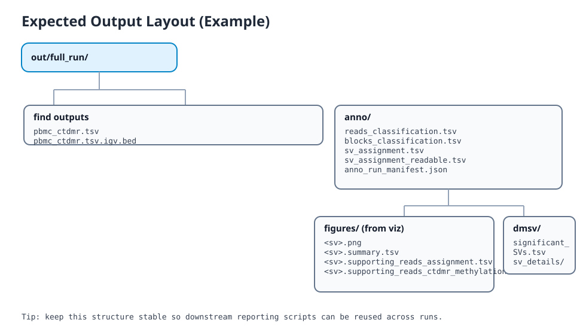
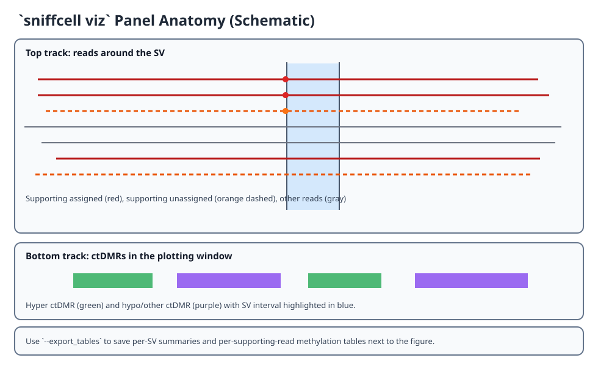

# End-to-End Workflow

This page walks through a full `sniffcell` run from ctDMR discovery to SV figures and differential methylation outputs.

## Figure 1: Pipeline Overview


## Figure 2: Expected Output Layout



## Figure 3: `viz` Panel Anatomy



## 1. Inputs

Prepare:
- long-read BAM with base-mod tags (`MM`/`ML`) and optional `HP`
- SV VCF (`INS`/`DEL` used)
- reference FASTA
- atlas files for `find` (npy/index/meta/json)

Example input paths:

```bash
ATLAS_NPY=atlas/all_celltypes_blocks.npy
ATLAS_INDEX=atlas/all_celltypes_blocks.index.gz
ATLAS_META=atlas/all_celltypes.txt
ATLAS_GROUPS=atlas/index_to_major_celltypes.json

BAM=sample.bam
VCF=sample.vcf.gz
REF=ref.fa
OUT=out/full_run
mkdir -p "$OUT"
```

## 2. (Optional) Build confident SV VCFs (`sniffcell-discover-sv`)

This dual-pass helper runs Sniffles on TR and non-TR regions, applies confidence filters, and writes a merged VCF for downstream `anno`.

```bash
sniffcell-discover-sv \
  -i "$BAM" \
  -r "$REF" \
  -o "$OUT/sv_discovery" \
  -t 8
```

Key outputs:
- `$OUT/sv_discovery/tr/sniffles.tr.confident.vcf.gz`
- `$OUT/sv_discovery/non_tr/sniffles.nontr.confident.vcf.gz`
- `$OUT/sv_discovery/merged/sniffles.confident.merged.vcf.gz`
- `$OUT/sv_discovery/sv_discovery_manifest.json`

Use merged VCF as `VCF` in later steps:

```bash
VCF="$OUT/sv_discovery/merged/sniffles.confident.merged.vcf.gz"
```

## 3. Call ctDMRs (`find`)

```bash
sniffcell find \
  -n "$ATLAS_NPY" \
  -i "$ATLAS_INDEX" \
  -m "$ATLAS_META" \
  -cf "$ATLAS_GROUPS" \
  -ck pbmc \
  -o "$OUT/pbmc_ctdmr.tsv" \
  --diff_threshold 0.40 \
  --min_rows 2 \
  --min_cpgs 3 \
  --max_gap_bp 500
```

Expected files:
- `$OUT/pbmc_ctdmr.tsv`
- `$OUT/pbmc_ctdmr.tsv.igv.bed`

## 4. Annotate SVs (`anno`)

```bash
sniffcell anno \
  -i "$BAM" \
  -v "$VCF" \
  -r "$REF" \
  -b "$OUT/pbmc_ctdmr.tsv" \
  -o "$OUT/anno" \
  -w 10000 \
  -t 8 \
  --evidence_mode all_rows \
  --min_overlap_pct 0.0 \
  --min_agreement_pct 1.0
```

Core outputs:
- `$OUT/anno/reads_classification.tsv`
- `$OUT/anno/blocks_classification.tsv`
- `$OUT/anno/sv_assignment.tsv`
- `$OUT/anno/sv_assignment_readable.tsv`
- `$OUT/anno/sv_assignment_readable_long.tsv`
- `$OUT/anno/anno_run_manifest.json`

## 5. Re-score with different assignment strictness (`svanno`)

Use this to compare strict vs relaxed assignments without re-running `anno`:

```bash
sniffcell svanno \
  -v "$VCF" \
  -i "$OUT/anno/reads_classification.tsv" \
  -o "$OUT/anno_relaxed" \
  -w 10000 \
  --evidence_mode all_rows \
  --min_overlap_pct 0.0 \
  --min_agreement_pct 0.6
```

## 6. Generate SV Figures (`viz`)

Single SV:

```bash
sniffcell viz \
  --anno_output "$OUT/anno" \
  -s sniffles.SV123 \
  -f png \
  --export_tables
```

Batch first 20 SVs:

```bash
mkdir -p "$OUT/figures"
cut -f1 "$OUT/anno/sv_assignment.tsv" | tail -n +2 | head -n 20 | while read -r sv; do
  sniffcell viz \
    --anno_output "$OUT/anno" \
    -s "$sv" \
    -o "$OUT/figures/$sv" \
    -f png \
    --export_tables
done
```

Per-SV files:
- `<sv>.png`
- `<sv>.summary.tsv`
- `<sv>.supporting_reads_assignment.tsv`
- `<sv>.supporting_reads_ctdmr_methylation.tsv`

## 7. Build High-Confidence SV Report (`report`)

Generate one HTML page (figure-less by default):

```bash
sniffcell report \
  --anno_output "$OUT/anno" \
  --min_overlap_pct 0.8 \
  --min_majority_pct 1.0
```

Outputs:
- `$OUT/anno/report/index.html`
- `$OUT/anno/report/high_confidence_sv.tsv`
- report entries include `Copy viz command` buttons for per-SV figure generation

Enable batch figure rendering:

```bash
sniffcell report \
  --anno_output "$OUT/anno" \
  --with_figures \
  --figure_threads 8 \
  -f png
```

Additional output:
- `$OUT/anno/report/figures/<sv_id>.viz.png`

Note:
- default is figure-less for speed.
- with `--with_figures`, runtime scales with selected SV count; use `--figure_threads` to parallelize.

## 8. Differential methylation near SVs (`dmsv`)

```bash
sniffcell dmsv \
  -i "$BAM" \
  -v "$VCF" \
  -r "$REF" \
  -o "$OUT/dmsv" \
  -m 3 \
  -f 1000 \
  -c 5 \
  -t 8
```

Outputs:
- `$OUT/dmsv/significant_SVs.tsv`
- `$OUT/dmsv/sv_details/<sv_id>.tsv.gz`

## 9. Quick QA checks

```bash
# Assigned SV count
awk -F'\t' 'NR>1 && $7!="" {c++} END{print c+0}' "$OUT/anno/sv_assignment.tsv"

# Hard-conflict SV count
awk -F'\t' 'NR==1{for(i=1;i<=NF;i++) if($i=="has_hard_conflict") c=i}
            NR>1 && $c=="True"{n++} END{print n+0}' "$OUT/anno/sv_assignment.tsv"

# Top linked cell types
cut -f11 "$OUT/anno/sv_assignment_readable.tsv" | tail -n +2 | tr '|' '\n' | sort | uniq -c | sort -nr | head
```

## 10. Common adjustments

- If few SVs are assigned, relax `--min_agreement_pct` via `svanno`.
- If `reads_classification.tsv` is sparse, increase `-w/--window`.
- If `viz` methylation tables are empty, confirm reference FASTA is available.
