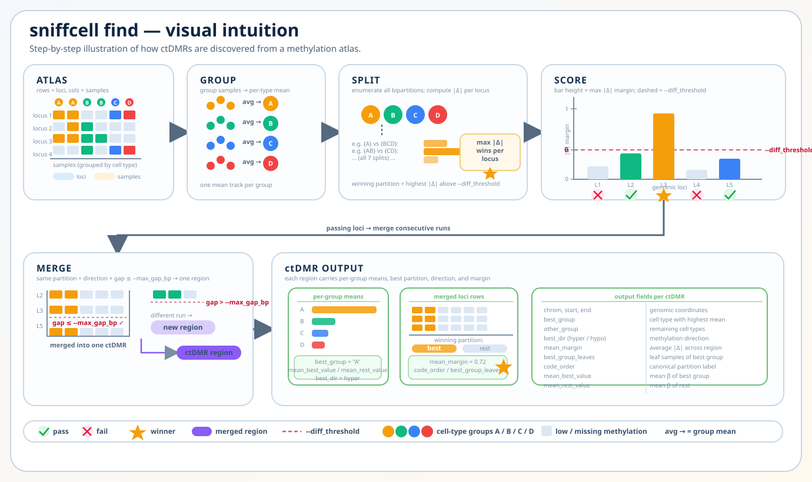

# SniffCell `find` Workflow

Structured workflow view:

`sniffcell find` converts atlas methylation blocks into annotation-ready ctDMRs by scoring group bipartitions at each atlas row and then merging consistent winning rows into regions.

The CLI defaults are `--diff_threshold 0.40`, `--min_rows 1`,
`--min_cpgs 3`, and `--max_gap_bp 2000`. A single atlas row may form a ctDMR
when it contains at least three CpGs and meets the methylation difference
threshold. Set `--min_rows 2` explicitly to require multiple atlas rows.

Shape-first visual intuition view:

Key ideas:

- Inputs are the atlas matrix (`.npy`), CpG index (`.index.gz`), sample metadata (`.txt`), and a JSON mapping of named groups to sample IDs.
- The selected `-ck/--celltypes_keys` entry is resolved into usable groups, and each group becomes one mean methylation track across atlas rows.
- The caller evaluates every unique non-empty bipartition of those groups, keeps the highest-margin passing split per row, and remembers whether the selected side is hyper or hypo.
- Compatible winning rows are merged into ctDMR regions, then summarized into fields such as `best_group`, `other_group`, `best_dir`, `mean_margin`, and per-group means.
- Outputs are the main ctDMR TSV/BED-style table and the IGV BED9 companion file.

Source paths:

- `src/sniffcell/find/find.py`
- `src/sniffcell/find/ctdmr.py`
