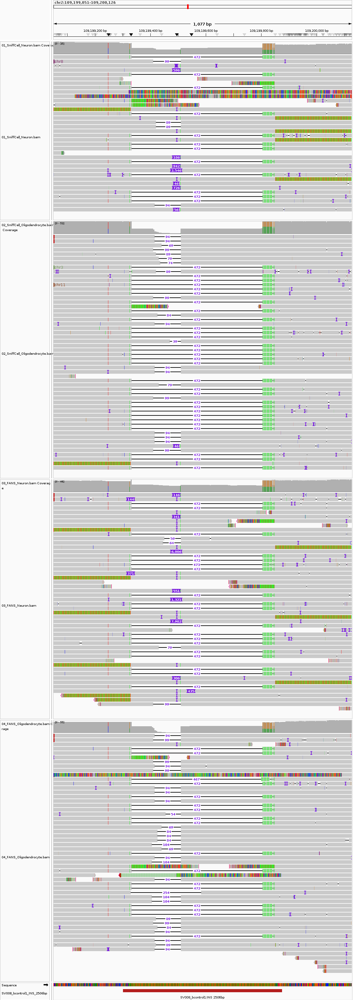
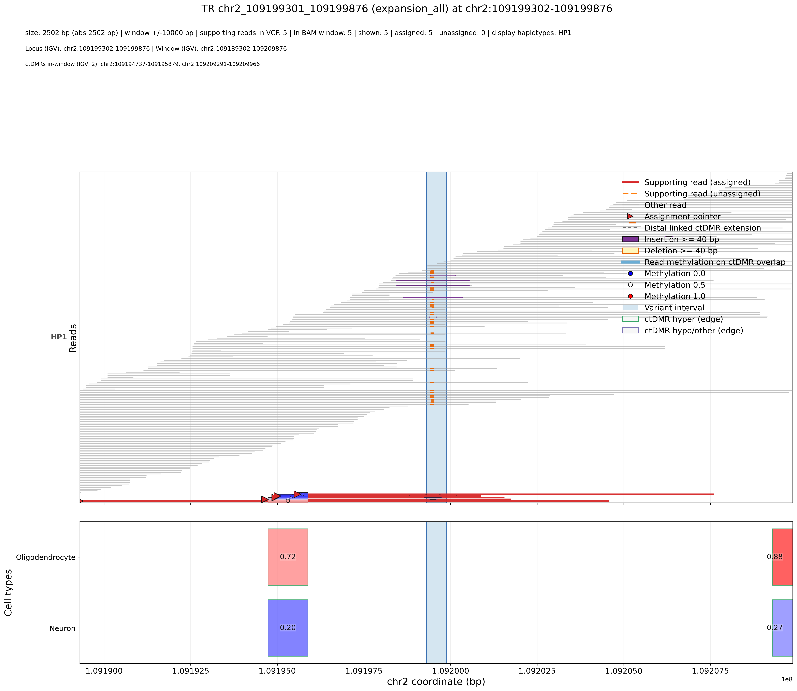

# SH3RF3 repeat expansion: complete SV and TR example

This example starts with a small bulk ONT BAM and a small methylation atlas,
then runs `sniffcell find`, `deconv`, `discover`, `anno`, `viz`, and `report`.
It demonstrates how SniffCell's SV and TR discovery branches can both detect
variation within the same complex repeat locus.

## The locus

- Reference: GRCh38 no-alt analysis set
- Region: `chr2:109199301-109199876`
- Gene: `SH3RF3`
- Repeat motif: `AATGG`
- Fixture: `tests/data/sh3rf3_dual_sv_tr`

The bundled BAM is a 45-kb regional slice (`chr2:109180000-109225000`) with
976 alignment records from 914 reads. The atlas subset contains six cortex
Neuron and three Oligodendrocyte samples across 164 nearby regions. The normal
GRCh38 sequence dictionary and genomic coordinates are retained.



## Requirements

Install SniffCell and all external discovery tools, then check them with:

```bash
sniffcell discover tools check --stages all
```

Provide an indexed copy of the GRCh38 no-alt analysis-set FASTA. Its `chr2`
entry must be 242,193,529 bp. The reference is not bundled because the full
FASTA is large:

```bash
samtools faidx /path/to/GRCh38_no_alt.fa
```

This is a native-GRCh38 fixture. No miniature contig or Sniffles
`--all-contigs` setting is needed.

## One-command run

From the repository root:

```bash
./tests/data/sh3rf3_dual_sv_tr/run_example.sh \
  /path/to/GRCh38_no_alt.fa \
  tests/data/sh3rf3_dual_sv_tr/output \
  4
```

The script validates the final outputs automatically. To follow the workflow
one command at a time, use the commands below.

## 1. Find ctDMRs from the atlas subset

```bash
EXAMPLE=tests/data/sh3rf3_dual_sv_tr
OUT="$EXAMPLE/output"
REF=/path/to/GRCh38_no_alt.fa

sniffcell find \
  -n "$EXAMPLE/inputs/atlas.npy" \
  -i "$EXAMPLE/inputs/atlas.index.tsv" \
  -m "$EXAMPLE/inputs/atlas.samples.txt" \
  -cf "$EXAMPLE/inputs/celltypes.json" \
  -ck brain_cereb \
  -o "$OUT/brain_cereb.ctdmr.tsv" \
  --diff_threshold 0.35 \
  --min_rows 1
```

The compact atlas produces seven ctDMRs. `--min_rows 1` is appropriate here
because the atlas itself was deliberately reduced to this small regional test.

## 2. Deconvolve and split the regional BAM

```bash
sniffcell deconv \
  -i "$EXAMPLE/inputs/SH3RF3_example.bam" \
  -r "$REF" \
  -b "$OUT/brain_cereb.ctdmr.tsv" \
  -o "$OUT/deconv" \
  --regions "$EXAMPLE/inputs/target.bed" \
  --regions-ctdmrs 4 \
  --split_bam_groups 'Neuron=Neuron;Oligodendrocyte=Oligodendrocyte' \
  --skip_overall_summary \
  -t 4
```

Expected split sizes are 182 Neuron reads and 356 Oligodendrocyte reads.

## 3. Discover SVs and TR changes

```bash
sniffcell discover tools run \
  --deconv-dir "$OUT/deconv" \
  --reference "$REF" \
  --tr-bed "$EXAMPLE/inputs/tr_catalog.bed" \
  --sex female \
  --sample-id SH3RF3_example \
  --run-id dual_sv_tr \
  --stages all \
  --sniffles-cluster-merge-len 0.31 \
  --threads 4
```

The harmonized result is written to:

```text
output/deconv/deconv_requested_group_splits/discover/dual_sv_tr/harmonized_variants.tsv
```

At the target locus, the TR branch reports a 2,502-bp `expansion_all` event as
`group_a_only`, supported by 5 Neuron reads and 0 Oligodendrocyte reads. The SV
branch independently reports a 726-bp Neuron-only insertion supported by three
reads with 596-, 726-, and 942-bp insertion alignments. A cluster length ratio
of `0.31` is used because this repeat has genuine allele-length heterogeneity.

## 4. Annotate the harmonized variants

```bash
HARMONIZED="$OUT/deconv/deconv_requested_group_splits/discover/dual_sv_tr/harmonized_variants.tsv"

sniffcell anno \
  -i "$EXAMPLE/inputs/SH3RF3_example.bam" \
  -v "$HARMONIZED" \
  -r "$REF" \
  -b "$OUT/brain_cereb.ctdmr.tsv" \
  -o "$OUT/anno" \
  --deconv-reads "$OUT/deconv/deconv_reads_classification.tsv" \
  --evidence_mode per_read \
  -w 10000 \
  -t 4
```

The expansion and insertion both receive Neuron assignments. All 5 expansion
reads and all 3 insertion reads overlap usable deconvolution evidence, with an
assignment majority of 1.0 for each call.

## 5. Visualize the expansion

```bash
sniffcell viz \
  --anno_output "$OUT/anno" \
  -s chr2_109199301_109199876 \
  -f png \
  --export_tables \
  -o "$OUT/anno/SH3RF3_TR_expansion.png"
```



## 6. Build the report

```bash
sniffcell report \
  --anno_output "$OUT/anno" \
  --include_unassigned \
  --with_figures \
  --figure_threads 4 \
  -o "$OUT/anno/report"
```

Open `output/anno/report/index.html` in a browser. The checked-in
`expected/harmonized_variants.tsv` and `expected/variant_assignment_readable.tsv`
provide compact regression references for the key calls.

## Validate an existing run

```bash
python tests/data/sh3rf3_dual_sv_tr/validate_outputs.py \
  tests/data/sh3rf3_dual_sv_tr/output
```

The validator checks native coordinates, the 2,502-bp Neuron expansion, the
726-bp Neuron insertion, deconvolution split sizes, assignment evidence, the
PNG, and the HTML report.
